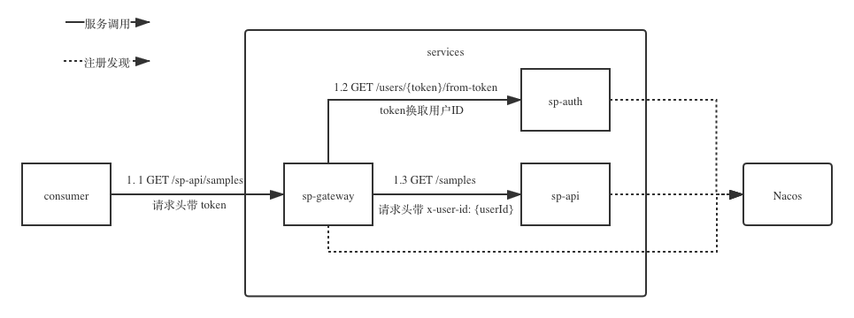

Gateway Bootcamp
================

## 依赖

* nacos 可参考 [Nacos Docker](https://nacos.io/en-us/docs/quick-start-docker.html)
* redis RedisRateLimiter依赖，参考docker-compose.yml启动redis

## 说明



* sp-api 后台服务 
* sp-auth 认证服务，提供token验证
* sp-gateway API网关，通过token换取用户ID，并透传给后台服务

调用 ```http://localhost:8071/sp-api/samples```, 并且带上请求头 ```Authorization: Bearer i.am.token```